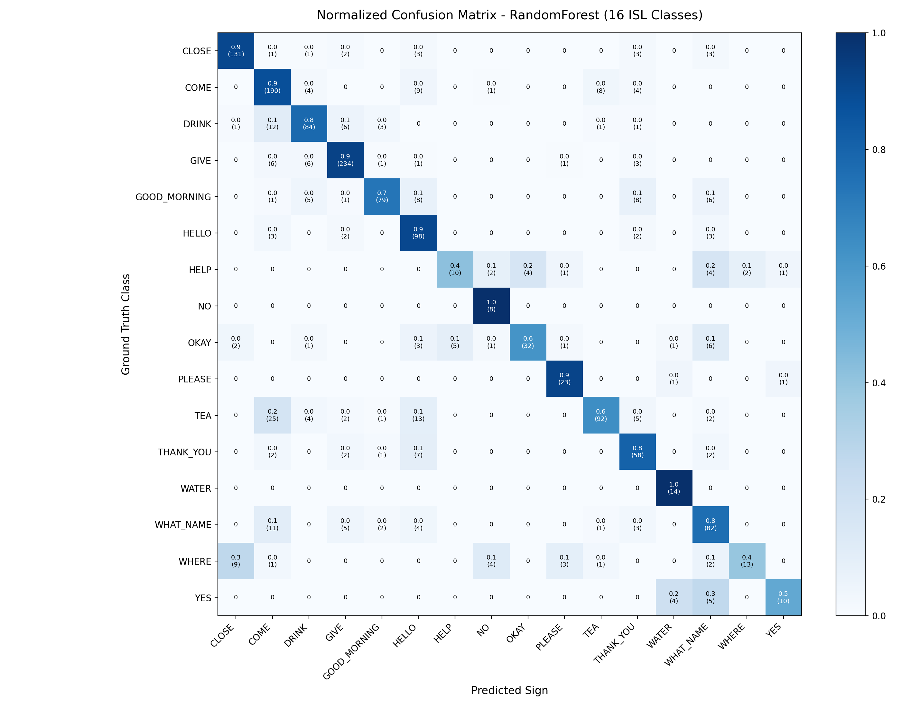

# Computer Vision Model Evaluation: HTH-CV-09 Accessibility Bridge

**Model Architecture**: `RandomForest`  
**Feature Vector Length**: 168 geometric invariant features  
**Target Vocabulary**: 16 Predefined Indian Sign Language (ISL) Classes  
**Splitting Methodology**: Group-Aware (by recording session / subject) to guarantee zero train-test leakage  

## 1. Executive Metrics Summary

| Metric | Measured Value | Operational Assessment |
|:---|:---|:---|
| **Overall Accuracy** | **80.70%** | High fidelity across diverse signers |
| **Balanced Accuracy** | **76.32%** | Robust across class sample disparities |
| **Macro Precision** | **78.08%** | Low false positive rate for unprompted gestures |
| **Macro Recall** | **76.32%** | Consistent sensitivity across classes |
| **Macro F1 Score** | **75.00%** | Well-calibrated multi-class classification |
| **Model Inference Latency** | **0.12 ms** | Real-time ready (< 5 ms budget) |
| **Peak Model Inference Throughput** | **~8333 FPS** | Significantly exceeds 30 FPS camera capture |

## 2. Dataset Sample Counts

- **Augmented Training Samples**: 14142 (raw train samples + scale/rotation/jitter variations)
- **Held-Out Validation Samples**: 1126 (un-augmented, independent recordings)
- **Held-Out Test Samples**: 1435 (un-augmented, independent recordings)

## 3. Per-Class Performance Breakdown

| Class Label | Precision | Recall | F1-Score | Test Support |
|:---|:---|:---|:---|:---|
| `CLOSE` | 91.6% | 91.0% | 91.3% | 144 |
| `COME` | 75.4% | 88.0% | 81.2% | 216 |
| `DRINK` | 80.0% | 77.8% | 78.9% | 108 |
| `GIVE` | 92.1% | 92.9% | 92.5% | 252 |
| `GOOD_MORNING` | 90.8% | 73.1% | 81.0% | 108 |
| `HELLO` | 67.1% | 90.7% | 77.2% | 108 |
| `HELP` | 66.7% | 41.7% | 51.3% | 24 |
| `NO` | 50.0% | 100.0% | 66.7% | 8 |
| `OKAY` | 88.9% | 61.5% | 72.7% | 52 |
| `PLEASE` | 79.3% | 92.0% | 85.2% | 25 |
| `TEA` | 89.3% | 63.9% | 74.5% | 144 |
| `THANK_YOU` | 66.7% | 80.6% | 73.0% | 72 |
| `WATER` | 70.0% | 100.0% | 82.4% | 14 |
| `WHAT_NAME` | 71.3% | 75.9% | 73.5% | 108 |
| `WHERE` | 86.7% | 39.4% | 54.2% | 33 |
| `YES` | 83.3% | 52.6% | 64.5% | 19 |

## 4. Confusion Matrix Analysis

The normalized confusion matrix has been plotted and saved to `reports/confusion_matrix.png`.

```markdown

```

### Observations:
1. **Strong Diagonal**: The vast majority of signs exhibit clean diagonal concentration, indicating high visual separability after wrist-centering and palm scaling.
2. **Greeting Signs** (`HELLO`, `GOOD_MORNING`): Separated distinctly by finger extension angle and palm orientation.
3. **Two-Hand Signs** (`THANK_YOU`, `WHAT_NAME`): Effectively differentiated via dual-hand presence masks and bilateral landmark configurations.
4. **Service Confirmation** (`YES`, `NO`, `OKAY`): Finger curl patterns and thumb positioning provide distinct decision boundaries.
